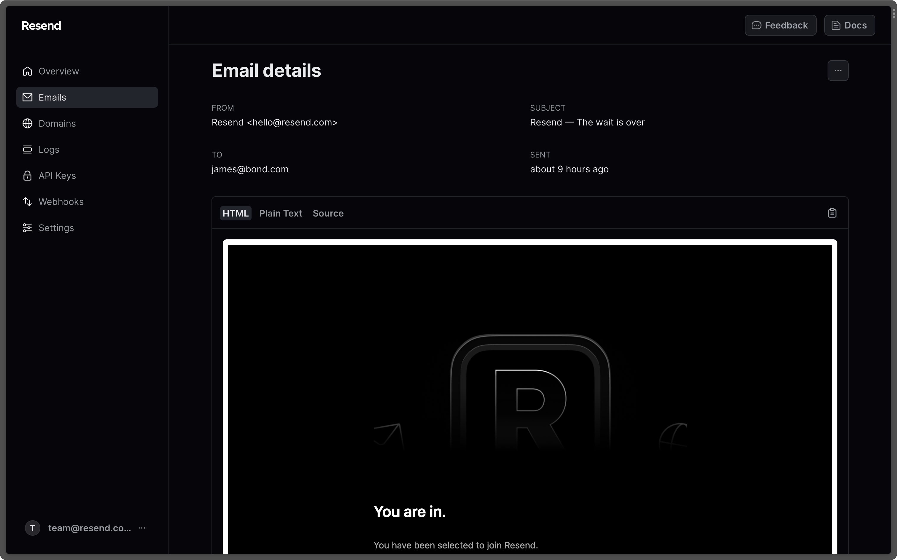

<div align="center">

[](https://resend.com)

# [Resend](https://resend.com)<a id="resend"></a>

Resend is the email platform for developers.

</div>

## Table of Contents<a id="table-of-contents"></a>

<!-- toc -->

- [Installation](#installation)
- [Getting Started](#getting-started)
- [Reference](#reference)
  * [`resend.apiKeys.createNewKey`](#resendapikeyscreatenewkey)
  * [`resend.apiKeys.getList`](#resendapikeysgetlist)
  * [`resend.apiKeys.removeExistingKey`](#resendapikeysremoveexistingkey)
  * [`resend.audiences.createContactList`](#resendaudiencescreatecontactlist)
  * [`resend.audiences.getList`](#resendaudiencesgetlist)
  * [`resend.audiences.getSingleAudience`](#resendaudiencesgetsingleaudience)
  * [`resend.audiences.removeExistingAudience`](#resendaudiencesremoveexistingaudience)
  * [`resend.contacts.createNewContact`](#resendcontactscreatenewcontact)
  * [`resend.contacts.getList`](#resendcontactsgetlist)
  * [`resend.contacts.getSingle`](#resendcontactsgetsingle)
  * [`resend.contacts.removeByEmail`](#resendcontactsremovebyemail)
  * [`resend.contacts.removeById`](#resendcontactsremovebyid)
  * [`resend.contacts.updateSingleContact`](#resendcontactsupdatesinglecontact)
  * [`resend.domains.createNewDomain`](#resenddomainscreatenewdomain)
  * [`resend.domains.getList`](#resenddomainsgetlist)
  * [`resend.domains.getSingleDomain`](#resenddomainsgetsingledomain)
  * [`resend.domains.removeDomain`](#resenddomainsremovedomain)
  * [`resend.domains.updateExistingDomain`](#resenddomainsupdateexistingdomain)
  * [`resend.domains.verifyDomain`](#resenddomainsverifydomain)
  * [`resend.emails.getSingleEmail`](#resendemailsgetsingleemail)
  * [`resend.emails.sendEmail`](#resendemailssendemail)
  * [`resend.emails.triggerBatchEmails`](#resendemailstriggerbatchemails)

<!-- tocstop -->

## Installation<a id="installation"></a>
<div align="center">
  <a href="https://konfigthis.com/sdk-sign-up?company=Resend&language=TypeScript">
    
  </a>
</div>

## Getting Started<a id="getting-started"></a>

```typescript
import { Resend } from "resend-typescript-sdk";

const resend = new Resend({
  // Defining the base path is optional and defaults to https://api.resend.com
  // basePath: "https://api.resend.com",
  accessToken: "ACCESS_TOKEN",
});

const createNewKeyResponse = await resend.apiKeys.createNewKey({
  name: "name_example",
  permission: "full_access",
});

console.log(createNewKeyResponse);
```

## Reference<a id="reference"></a>


### `resend.apiKeys.createNewKey`<a id="resendapikeyscreatenewkey"></a>

Create a new API key

#### 🛠️ Usage<a id="🛠️-usage"></a>

```typescript
const createNewKeyResponse = await resend.apiKeys.createNewKey({
  name: "name_example",
  permission: "full_access",
});
```

#### ⚙️ Parameters<a id="⚙️-parameters"></a>

##### name: `string`<a id="name-string"></a>

The API key name.

##### permission: `string`<a id="permission-string"></a>

The API key can have full access to Resend’s API or be only restricted to send emails. * full_access - Can create, delete, get, and update any resource. * sending_access - Can only send emails.

##### domain_id: `string`<a id="domain_id-string"></a>

Restrict an API key to send emails only from a specific domain. Only used when the permission is sending_acces.

#### 🔄 Return<a id="🔄-return"></a>

[CreateApiKeyResponse](./models/create-api-key-response.ts)

#### 🌐 Endpoint<a id="🌐-endpoint"></a>

`/api-keys` `POST`

[🔙 **Back to Table of Contents**](#table-of-contents)

---


### `resend.apiKeys.getList`<a id="resendapikeysgetlist"></a>

Retrieve a list of API keys

#### 🛠️ Usage<a id="🛠️-usage"></a>

```typescript
const getListResponse = await resend.apiKeys.getList();
```

#### 🔄 Return<a id="🔄-return"></a>

[ListApiKeysResponse](./models/list-api-keys-response.ts)

#### 🌐 Endpoint<a id="🌐-endpoint"></a>

`/api-keys` `GET`

[🔙 **Back to Table of Contents**](#table-of-contents)

---


### `resend.apiKeys.removeExistingKey`<a id="resendapikeysremoveexistingkey"></a>

Remove an existing API key

#### 🛠️ Usage<a id="🛠️-usage"></a>

```typescript
const removeExistingKeyResponse = await resend.apiKeys.removeExistingKey({
  apiKeyId: "apiKeyId_example",
});
```

#### ⚙️ Parameters<a id="⚙️-parameters"></a>

##### apiKeyId: `string`<a id="apikeyid-string"></a>

#### 🌐 Endpoint<a id="🌐-endpoint"></a>

`/api-keys/{api_key_id}` `DELETE`

[🔙 **Back to Table of Contents**](#table-of-contents)

---


### `resend.audiences.createContactList`<a id="resendaudiencescreatecontactlist"></a>

Create a list of contacts

#### 🛠️ Usage<a id="🛠️-usage"></a>

```typescript
const createContactListResponse = await resend.audiences.createContactList({
  name: "name_example",
});
```

#### ⚙️ Parameters<a id="⚙️-parameters"></a>

##### name: `string`<a id="name-string"></a>

The name of the audience you want to create.

#### 🔄 Return<a id="🔄-return"></a>

[CreateAudienceResponseSuccess](./models/create-audience-response-success.ts)

#### 🌐 Endpoint<a id="🌐-endpoint"></a>

`/audiences` `POST`

[🔙 **Back to Table of Contents**](#table-of-contents)

---


### `resend.audiences.getList`<a id="resendaudiencesgetlist"></a>

Retrieve a list of audiences

#### 🛠️ Usage<a id="🛠️-usage"></a>

```typescript
const getListResponse = await resend.audiences.getList();
```

#### 🔄 Return<a id="🔄-return"></a>

[ListAudiencesResponseSuccess](./models/list-audiences-response-success.ts)

#### 🌐 Endpoint<a id="🌐-endpoint"></a>

`/audiences` `GET`

[🔙 **Back to Table of Contents**](#table-of-contents)

---


### `resend.audiences.getSingleAudience`<a id="resendaudiencesgetsingleaudience"></a>

Retrieve a single audience

#### 🛠️ Usage<a id="🛠️-usage"></a>

```typescript
const getSingleAudienceResponse = await resend.audiences.getSingleAudience({
  id: "id_example",
});
```

#### ⚙️ Parameters<a id="⚙️-parameters"></a>

##### id: `string`<a id="id-string"></a>

#### 🔄 Return<a id="🔄-return"></a>

[GetAudienceResponseSuccess](./models/get-audience-response-success.ts)

#### 🌐 Endpoint<a id="🌐-endpoint"></a>

`/audiences/{id}` `GET`

[🔙 **Back to Table of Contents**](#table-of-contents)

---


### `resend.audiences.removeExistingAudience`<a id="resendaudiencesremoveexistingaudience"></a>

Remove an existing audience

#### 🛠️ Usage<a id="🛠️-usage"></a>

```typescript
const removeExistingAudienceResponse =
  await resend.audiences.removeExistingAudience({
    id: "id_example",
  });
```

#### ⚙️ Parameters<a id="⚙️-parameters"></a>

##### id: `string`<a id="id-string"></a>

#### 🔄 Return<a id="🔄-return"></a>

[RemoveAudienceResponseSuccess](./models/remove-audience-response-success.ts)

#### 🌐 Endpoint<a id="🌐-endpoint"></a>

`/audiences/{id}` `DELETE`

[🔙 **Back to Table of Contents**](#table-of-contents)

---


### `resend.contacts.createNewContact`<a id="resendcontactscreatenewcontact"></a>

Create a new contact

#### 🛠️ Usage<a id="🛠️-usage"></a>

```typescript
const createNewContactResponse = await resend.contacts.createNewContact({
  audienceId: "audience_id_example",
  requestBody: {
    email: "steve.wozniak@gmail.com",
    first_name: "Steve",
    last_name: "Wozniak",
    unsubscribed: false,
    audience_id: "78261eea-8f8b-4381-83c6-79fa7120f1cf",
  },
});
```

#### ⚙️ Parameters<a id="⚙️-parameters"></a>

##### audienceId: `string`<a id="audienceid-string"></a>

##### requestBody: [`CreateContactOptions`](./models/create-contact-options.ts)<a id="requestbody-createcontactoptionsmodelscreate-contact-optionsts"></a>

#### 🔄 Return<a id="🔄-return"></a>

[CreateContactResponseSuccess](./models/create-contact-response-success.ts)

#### 🌐 Endpoint<a id="🌐-endpoint"></a>

`/audiences/{audience_id}/contacts` `POST`

[🔙 **Back to Table of Contents**](#table-of-contents)

---


### `resend.contacts.getList`<a id="resendcontactsgetlist"></a>

Retrieve a list of contacts

#### 🛠️ Usage<a id="🛠️-usage"></a>

```typescript
const getListResponse = await resend.contacts.getList({
  audienceId: "audienceId_example",
});
```

#### ⚙️ Parameters<a id="⚙️-parameters"></a>

##### audienceId: `string`<a id="audienceid-string"></a>

#### 🔄 Return<a id="🔄-return"></a>

[ListContactsResponseSuccess](./models/list-contacts-response-success.ts)

#### 🌐 Endpoint<a id="🌐-endpoint"></a>

`/audiences/{audience_id}/contacts` `GET`

[🔙 **Back to Table of Contents**](#table-of-contents)

---


### `resend.contacts.getSingle`<a id="resendcontactsgetsingle"></a>

Retrieve a single contact

#### 🛠️ Usage<a id="🛠️-usage"></a>

```typescript
const getSingleResponse = await resend.contacts.getSingle({
  id: "id_example",
  audienceId: "audienceId_example",
});
```

#### ⚙️ Parameters<a id="⚙️-parameters"></a>

##### id: `string`<a id="id-string"></a>

##### audienceId: `string`<a id="audienceid-string"></a>

#### 🔄 Return<a id="🔄-return"></a>

[GetContactResponseSuccess](./models/get-contact-response-success.ts)

#### 🌐 Endpoint<a id="🌐-endpoint"></a>

`/audiences/{audience_id}/contacts/{id}` `GET`

[🔙 **Back to Table of Contents**](#table-of-contents)

---


### `resend.contacts.removeByEmail`<a id="resendcontactsremovebyemail"></a>

Remove an existing contact by email

#### 🛠️ Usage<a id="🛠️-usage"></a>

```typescript
const removeByEmailResponse = await resend.contacts.removeByEmail({
  email: "email_example",
  audienceId: "audienceId_example",
});
```

#### ⚙️ Parameters<a id="⚙️-parameters"></a>

##### email: `string`<a id="email-string"></a>

##### audienceId: `string`<a id="audienceid-string"></a>

#### 🔄 Return<a id="🔄-return"></a>

[RemoveContactResponseSuccess](./models/remove-contact-response-success.ts)

#### 🌐 Endpoint<a id="🌐-endpoint"></a>

`/audiences/{audience_id}/contacts/{email}` `DELETE`

[🔙 **Back to Table of Contents**](#table-of-contents)

---


### `resend.contacts.removeById`<a id="resendcontactsremovebyid"></a>

Remove an existing contact by id

#### 🛠️ Usage<a id="🛠️-usage"></a>

```typescript
const removeByIdResponse = await resend.contacts.removeById({
  id: "id_example",
  audienceId: "audienceId_example",
});
```

#### ⚙️ Parameters<a id="⚙️-parameters"></a>

##### id: `string`<a id="id-string"></a>

##### audienceId: `string`<a id="audienceid-string"></a>

#### 🔄 Return<a id="🔄-return"></a>

[RemoveContactResponseSuccess](./models/remove-contact-response-success.ts)

#### 🌐 Endpoint<a id="🌐-endpoint"></a>

`/audiences/{audience_id}/contacts/{id}` `DELETE`

[🔙 **Back to Table of Contents**](#table-of-contents)

---


### `resend.contacts.updateSingleContact`<a id="resendcontactsupdatesinglecontact"></a>

Update a single contact

#### 🛠️ Usage<a id="🛠️-usage"></a>

```typescript
const updateSingleContactResponse = await resend.contacts.updateSingleContact({
  id: "id_example",
  audienceId: "audienceId_example",
  email: "steve.wozniak@gmail.com",
  first_name: "Steve",
  last_name: "Wozniak",
  unsubscribed: false,
});
```

#### ⚙️ Parameters<a id="⚙️-parameters"></a>

##### id: `string`<a id="id-string"></a>

##### audienceId: `string`<a id="audienceid-string"></a>

##### email: `string`<a id="email-string"></a>

Email address of the contact.

##### first_name: `string`<a id="first_name-string"></a>

First name of the contact.

##### last_name: `string`<a id="last_name-string"></a>

Last name of the contact.

##### unsubscribed: `boolean`<a id="unsubscribed-boolean"></a>

Indicates the subscription status of the contact.

#### 🔄 Return<a id="🔄-return"></a>

[UpdateContactResponseSuccess](./models/update-contact-response-success.ts)

#### 🌐 Endpoint<a id="🌐-endpoint"></a>

`/audiences/{audience_id}/contacts/{id}` `PATCH`

[🔙 **Back to Table of Contents**](#table-of-contents)

---


### `resend.domains.createNewDomain`<a id="resenddomainscreatenewdomain"></a>

Create a new domain

#### 🛠️ Usage<a id="🛠️-usage"></a>

```typescript
const createNewDomainResponse = await resend.domains.createNewDomain({
  name: "name_example",
  region: "us-east-1",
});
```

#### ⚙️ Parameters<a id="⚙️-parameters"></a>

##### name: `string`<a id="name-string"></a>

The name of the domain you want to create.

##### region: `string`<a id="region-string"></a>

The region where emails will be sent from. Possible values are us-east-1\\\' | \\\'eu-west-1\\\' | \\\'sa-east-1

#### 🔄 Return<a id="🔄-return"></a>

[CreateDomainResponse](./models/create-domain-response.ts)

#### 🌐 Endpoint<a id="🌐-endpoint"></a>

`/domains` `POST`

[🔙 **Back to Table of Contents**](#table-of-contents)

---


### `resend.domains.getList`<a id="resenddomainsgetlist"></a>

Retrieve a list of domains

#### 🛠️ Usage<a id="🛠️-usage"></a>

```typescript
const getListResponse = await resend.domains.getList();
```

#### 🔄 Return<a id="🔄-return"></a>

[ListDomainsResponse](./models/list-domains-response.ts)

#### 🌐 Endpoint<a id="🌐-endpoint"></a>

`/domains` `GET`

[🔙 **Back to Table of Contents**](#table-of-contents)

---


### `resend.domains.getSingleDomain`<a id="resenddomainsgetsingledomain"></a>

Retrieve a single domain

#### 🛠️ Usage<a id="🛠️-usage"></a>

```typescript
const getSingleDomainResponse = await resend.domains.getSingleDomain({
  domainId: "domainId_example",
});
```

#### ⚙️ Parameters<a id="⚙️-parameters"></a>

##### domainId: `string`<a id="domainid-string"></a>

#### 🔄 Return<a id="🔄-return"></a>

[Domain](./models/domain.ts)

#### 🌐 Endpoint<a id="🌐-endpoint"></a>

`/domains/{domain_id}` `GET`

[🔙 **Back to Table of Contents**](#table-of-contents)

---


### `resend.domains.removeDomain`<a id="resenddomainsremovedomain"></a>

Remove an existing domain

#### 🛠️ Usage<a id="🛠️-usage"></a>

```typescript
const removeDomainResponse = await resend.domains.removeDomain({
  domainId: "domainId_example",
});
```

#### ⚙️ Parameters<a id="⚙️-parameters"></a>

##### domainId: `string`<a id="domainid-string"></a>

#### 🔄 Return<a id="🔄-return"></a>

[DeleteDomainResponse](./models/delete-domain-response.ts)

#### 🌐 Endpoint<a id="🌐-endpoint"></a>

`/domains/{domain_id}` `DELETE`

[🔙 **Back to Table of Contents**](#table-of-contents)

---


### `resend.domains.updateExistingDomain`<a id="resenddomainsupdateexistingdomain"></a>

Update an existing domain

#### 🛠️ Usage<a id="🛠️-usage"></a>

```typescript
const updateExistingDomainResponse = await resend.domains.updateExistingDomain({
  domainId: "domainId_example",
  click_tracking: true,
  open_tracking: true,
});
```

#### ⚙️ Parameters<a id="⚙️-parameters"></a>

##### domainId: `string`<a id="domainid-string"></a>

##### click_tracking: `boolean`<a id="click_tracking-boolean"></a>

Enable or disable click tracking for the domain.

##### open_tracking: `boolean`<a id="open_tracking-boolean"></a>

Enable or disable open tracking for the domain.

#### 🔄 Return<a id="🔄-return"></a>

[UpdateDomainResponseSuccess](./models/update-domain-response-success.ts)

#### 🌐 Endpoint<a id="🌐-endpoint"></a>

`/domains/{domain_id}` `PATCH`

[🔙 **Back to Table of Contents**](#table-of-contents)

---


### `resend.domains.verifyDomain`<a id="resenddomainsverifydomain"></a>

Verify an existing domain

#### 🛠️ Usage<a id="🛠️-usage"></a>

```typescript
const verifyDomainResponse = await resend.domains.verifyDomain({
  domainId: "domainId_example",
});
```

#### ⚙️ Parameters<a id="⚙️-parameters"></a>

##### domainId: `string`<a id="domainid-string"></a>

#### 🔄 Return<a id="🔄-return"></a>

[VerifyDomainResponse](./models/verify-domain-response.ts)

#### 🌐 Endpoint<a id="🌐-endpoint"></a>

`/domains/{domain_id}/verify` `POST`

[🔙 **Back to Table of Contents**](#table-of-contents)

---


### `resend.emails.getSingleEmail`<a id="resendemailsgetsingleemail"></a>

Retrieve a single email

#### 🛠️ Usage<a id="🛠️-usage"></a>

```typescript
const getSingleEmailResponse = await resend.emails.getSingleEmail({
  emailId: "emailId_example",
});
```

#### ⚙️ Parameters<a id="⚙️-parameters"></a>

##### emailId: `string`<a id="emailid-string"></a>

#### 🔄 Return<a id="🔄-return"></a>

[Email](./models/email.ts)

#### 🌐 Endpoint<a id="🌐-endpoint"></a>

`/emails/{email_id}` `GET`

[🔙 **Back to Table of Contents**](#table-of-contents)

---


### `resend.emails.sendEmail`<a id="resendemailssendemail"></a>

Send an email

#### 🛠️ Usage<a id="🛠️-usage"></a>

```typescript
const sendEmailResponse = await resend.emails.sendEmail({
  from: "from_example",
  to: ["to_example"],
  subject: "subject_example",
});
```

#### ⚙️ Parameters<a id="⚙️-parameters"></a>

##### from: `string`<a id="from-string"></a>

Sender email address. To include a friendly name, use the format \\\"Your Name <sender@domain.com>\\\".

##### to: `string`[]<a id="to-string"></a>

##### subject: `string`<a id="subject-string"></a>

Email subject.

##### tags: [`Tag`](./models/tag.ts)[]<a id="tags-tagmodelstagts"></a>

##### bcc: `string`<a id="bcc-string"></a>

Bcc recipient email address. For multiple addresses, send as an array of strings.

##### cc: `string`<a id="cc-string"></a>

Cc recipient email address. For multiple addresses, send as an array of strings.

##### reply_to: `string`<a id="reply_to-string"></a>

Reply-to email address. For multiple addresses, send as an array of strings.

##### html: `string`<a id="html-string"></a>

The HTML version of the message.

##### text: `string`<a id="text-string"></a>

The plain text version of the message.

##### headers: `object`<a id="headers-object"></a>

Custom headers to add to the email.

##### attachments: [`Attachment`](./models/attachment.ts)[]<a id="attachments-attachmentmodelsattachmentts"></a>

#### 🔄 Return<a id="🔄-return"></a>

[SendEmailResponse](./models/send-email-response.ts)

#### 🌐 Endpoint<a id="🌐-endpoint"></a>

`/emails` `POST`

[🔙 **Back to Table of Contents**](#table-of-contents)

---


### `resend.emails.triggerBatchEmails`<a id="resendemailstriggerbatchemails"></a>

Trigger up to 100 batch emails at once.

#### 🛠️ Usage<a id="🛠️-usage"></a>

```typescript
const triggerBatchEmailsResponse = await resend.emails.triggerBatchEmails([
  {
    from: "from_example",
    to: ["to_example"],
    subject: "subject_example",
  },
]);
```

#### ⚙️ Request Body<a id="⚙️-request-body"></a>

[`SendEmailRequest`](./models/send-email-request.ts)[]

#### 🔄 Return<a id="🔄-return"></a>

[CreateBatchEmailsResponse](./models/create-batch-emails-response.ts)

#### 🌐 Endpoint<a id="🌐-endpoint"></a>

`/emails/batch` `POST`

[🔙 **Back to Table of Contents**](#table-of-contents)

---


## Author<a id="author"></a>
This TypeScript package is automatically generated by [Konfig](https://konfigthis.com)
